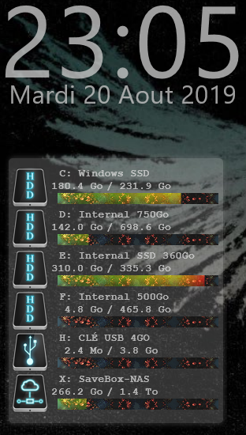

# rainmeter

The following repo contains two rainmeter widgets:
  - Clock: Displays the current hour using the 24:00 format on top and the current date underneath (in french)
  - Drives: Displays `fixed`, `network` and `removable` drives, with drive letter, name and occupation metrics (french units).
            Clicking the image opens the corresponding drive in the explorer

Overview:

_Please note that the wing is part of my desktop background and thus, not part of the theme_.